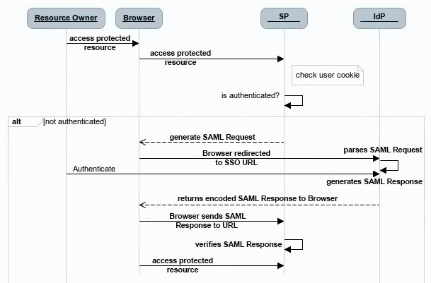
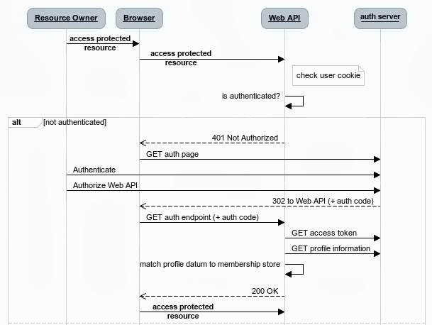

# OADA API Reference Implementation


## Introduction


This open source implementation provides a basic skeleton implementation for OADA REST APIs. This reference implementation is in Java and is built using a combination of:
* Spring MVC 
* Spring Security integrated with Spring SAML and Spring OAuth. 

The goal of this reference implementation is not to be exhaustive in terms of data formats or backend storage systems. It is intended to be a reference implementation that illustrates how OADA Federated Identity could be implemented and on which various parties can build their implementations.

## OADA Federated Identity

### Single Sign On (SSO) via Security Assertion Markup Language (SAML)

OADA Identity Federation is made up of all entities that decide to accept identity assertions from one another. For a complete background on OADA Federated Identity see [OADA Federated Identity] (https://github.com/OADA/oada-wiki/wiki/Federated-Identity)

This reference implementation implements SSO using Spring Security SAML Extension with SSO Circle IDP service using SAML 2.0 protocol. Here is an overview of how SAML works in the context of SSO.



We have a working example of Web SSO against a single Identity Provider. This can be extended to multiple identity providers. In the context of SAML this reference application is a "Service Provider" and SSOCircle (http://www.ssocircle.com) is the "Identity Provider". SSOCircle is a free SAML identity provider, which provides us with a very nice way of testing a SAML-based service provider without having to install a SAML identity provider. Here's how we do it.

* We have created a SSOCircle test account (Username: tcc-oada-1 Password: testoada)
* We have uploaded our service provider metadata (more on this later) into https://idp.ssocircle.com/sso/hos/ManageSPMetadata.jsp

We have used Spring SAML Sample App as a reference to perform this integration. For more on this see: http://docs.spring.io/spring-security-saml/docs/1.0.x/reference/html/chapter-quick-start.html#quick-start-sp-metadata

#### Spring SAML Configuration

We have to added all the SAML beans in the saml-spring-security.xml

##### Generating SP Metadata

Modify metadataGeneratorFilter to specify an unique "entityId".

```
<bean id="metadataGeneratorFilter" class="org.springframework.security.saml.metadata.MetadataGeneratorFilter">
	<constructor-arg>
		<bean class="org.springframework.security.saml.metadata.MetadataGenerator">
		<property name="entityId" value="saml-test-app:test-oada-2:sanfrancisco"/>
		<property name="signMetadata" value="false"/>
		</bean>
	</constructor-arg>
</bean>
```

##### Downloading SP Metadata

Once you deploy this reference web application locally, SP metadata can be downloaded via http://localhost:8080/saml/metadata. This XML document gets uploaded to SSOCircle.


### OAUTH 2.0 Support

In order to access a protected resource (viz. /oada/resources) client needs to provide an access token (OAuth 2.0 token). Server will authenticate the request based on the token. If token is valid then client will get an access to protected resource otherwise access is denied.

Here is how OAuth works:



#### Spring OAuth 2.0 Configuration

We have added all OAuth 2.0 beans in spring-security.xml. The reference implementation uses in memory token store.

* A client application will send request to the URL “http://localhost:8080/oauth/token?grant_type=implicit” to retrieve an access token. 
* Client is then pushed into the WebSSO work flow. In our case user needs to login via SSOCircle.
** Client logs into SSOCircle
** SSOCircle redirects the client back to our reference application. To be specific it redirects the client to http://localhost:8080/saml/SSO/alias/defaultAlias. This URL is part of the SP Metadata that we uploaded to SSO Circle.
* Reference application then generates OAuth 2.0 token.

Each OADA REST API requires an Authorization header with the OAuth token.

### Spring Security + Spring SAML + Spring OAuth 

The main interface which provides authentication services in Spring Security is the AuthenticationManager. The bean instance is registered using the "authentication-manager" namespace element. This Authentication Manager is the one that is responsible for the user’s authentication. Within it, there is a declaration of the provider, which holds the users and passwords. In most real world implementations, this provider directs to a JDBC, where all users are stored with their encrypted passwords. In case of WebSSO, we do not have to handle any users and passwords, since we delegate this to the IdP. So, we change the declaration of our server to point to the authentication manager of the SAML SP: this manager has a provider (SAMLAuthenticationProvider or some other class that extends it). This class implements the authenticate() method, that attempts to perform authentication of an Authentication object. 

So in summary we end up with these changes:

```
  <http authentication-manager-ref="authenticationManager"
    entry-point-ref="samlEntryPoint">
    <intercept-url pattern="/oauth/**" access="ROLE_USER" />
    <intercept-url pattern="/**" access="IS_AUTHENTICATED_FULLY" />
    <anonymous enabled="false" />
    <custom-filter before="FIRST" ref="metadataGeneratorFilter" />
    <custom-filter after="BASIC_AUTH_FILTER" ref="samlFilter" />
  </http>
```


